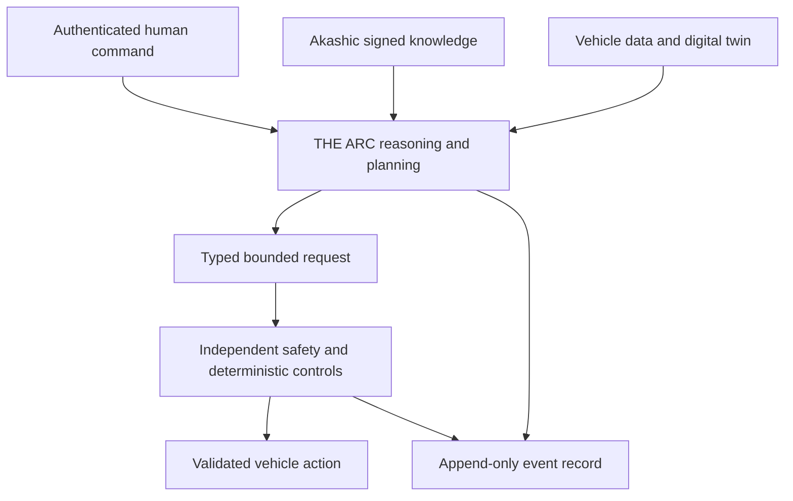

# CRTFE V-2 ARC and Akashic Record Vessel Integration

> Revision P0 — 2026-08-24  
> Status: preliminary system architecture. Not flight-ready avionics and not an authorization for autonomous actuator control.

## Definition

**THE ARC** is the vessel reasoning, diagnosis, planning and human-command orchestration layer.

The **Akashic Record** is T.A.R.'s signed, versioned knowledge and mission-memory layer. The name is a project metaphor; it is not a claim of supernatural access, omniscience or a physical energy source.

The Akashic Record is an electrical load. It does not power the ship. Propulsion energy and avionics/compute energy remain separate engineering systems.

## Architecture



## Five integration planes

| Plane | Function | Safety boundary |
|---|---|---|
| Data | Timestamped sensor, health, mission and test-data ingest | Read-only subscriptions by default; data-quality flags retained |
| Knowledge | Signed/versioned sources, procedures, models, claims and contradictions | Established fact, measurement, model, inference and speculation stay distinct |
| Reasoning | Retrieval with citations, diagnosis, planning, digital-twin comparison and confidence | Recommendations are non-executable |
| Command mediation | Converts authenticated human intent into typed requests with limits and expiry | No raw actuator, HV, contactor, quench, interlock or flight-control API |
| Safety | Independent monitors, deterministic controllers, pilot override and hardwired protection | Cannot be disabled or reconfigured by ARC |

## Electrical power architecture

The first design study shall use a bottom-up load budget rather than a guessed wattage.

Candidate topology:

```text
Propulsion energy system
    -> isolated avionics DC/DC A ----+
                                     +--> essential avionics bus --> ARC compute A / storage / network
    -> isolated avionics DC/DC B ----+                         `--> ARC compute B

Dedicated emergency battery / UPS --> safe shutdown, critical logging and minimal communications
Optional supercapacitor ------------> short transient ride-through only
```

Required power-budget rows:

- redundant compute modules and accelerators
- trusted safety gateway
- storage and append-only recorder
- time synchronization and networking
- sensor/data acquisition interfaces
- communications
- cooling pumps, fans or cold plates
- cryptographic hardware and secure boot support
- display/human interface
- emergency hold-up and graceful shutdown

For every row, record normal, peak, startup, degraded and emergency power; voltage; efficiency; heat; mass; volume; cable/interface assumptions; and confidence/evidence class. Bus voltages, UPS duration and total load remain `TBD` until the hardware trade is complete.

## Authority matrix

| Function | ARC | Deterministic controller | Independent safety | Pilot/operator |
|---|---|---|---|---|
| Read approved telemetry | Allowed | Allowed | Allowed | Allowed |
| Diagnose and recommend | Allowed | Limited | Monitor | Accept/reject |
| Submit bounded request | Allowed after authentication | Receive/validate | Veto | Authorize |
| Direct actuator command | Prohibited | Allowed within certified logic | Veto/interlock | Manual authority |
| Change safety limits | Prohibited | Prohibited in operation | Controlled maintenance only | Formal procedure |
| Operate HV contactors or HTS dump | Prohibited | Dedicated protection only | Independent authority | Emergency/manual controls |

## Knowledge rules

The system may contain a broad, sourced space-science and engineering corpus, but it shall never claim to know everything. Every answer or recommendation shall expose:

- source citations and retrieval date
- vehicle configuration and software/model version
- evidence class and confidence
- supporting and opposing evidence
- assumptions and applicable physical regime
- contradictions and unresolved questions
- falsification or verification test

Zero-point energy, warp/FTL, spacetime manipulation, Akashic access or similar claims remain `SPECULATIVE` unless independently demonstrated. They may not change a control limit or create an executable command.

## Environmental and cybersecurity requirements

- physically and electrically separate compute from propulsion HV and switching noise
- galvanic isolation and fiber links where fault or EMI analysis requires them
- HIRF/EMI, conducted-emissions, magnetic-field and transient testing in installed configuration
- secure boot, signed updates, hardware-rooted identity and key rotation
- network segmentation, least privilege and unidirectional/read-only gateways where practical
- offline-first approved knowledge cache for lost-link operation
- append-only, hash-chained event records and protected time source
- fail-operational deterministic control and fail-silent/fail-safe ARC behavior
- no silent model, knowledge or software updates during a mission

## Development gates

1. requirements and authority matrix approved
2. bottom-up power/thermal/mass budget completed
3. software-in-the-loop with malformed, stale and unsafe request rejection
4. hardware-in-the-loop with redundant compute, bus dropouts and timing faults
5. cyber threat model and recovery drill
6. installed EMI/HIRF and propulsion-switching coexistence test
7. degraded-mode and total-ARC-loss demonstration
8. ground iron-bird integration
9. narrow uncrewed testing only after independent vehicle and safety review

Crewed use requires a separate formal safety case and certification strategy.

