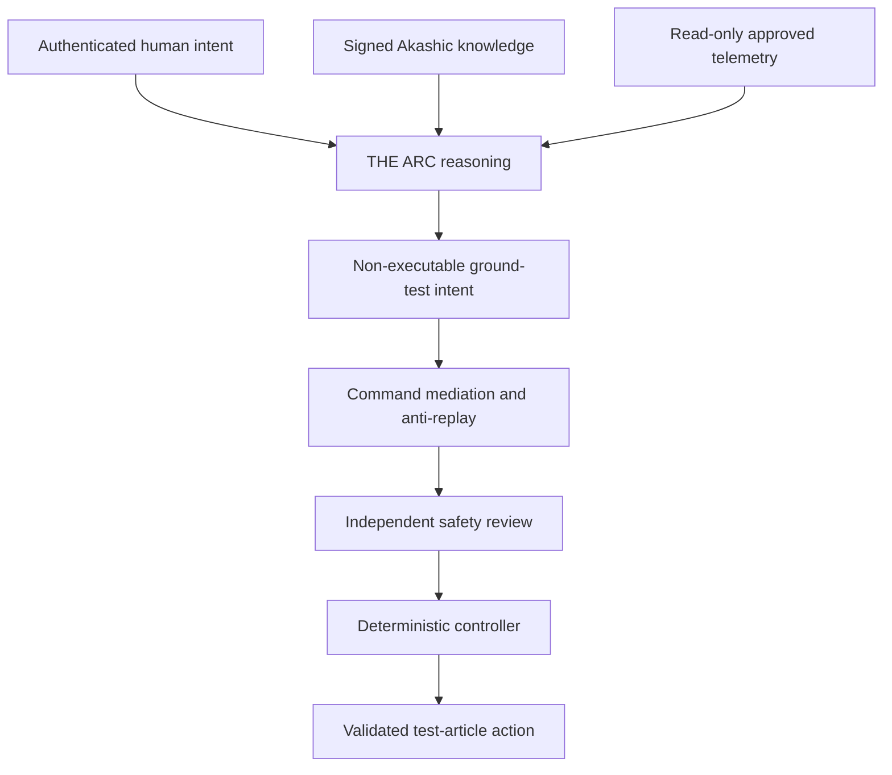

# CRTFE V-2 ARC and Akashic Record Vessel Integration

> Controlled revision: 1.3 — 2026-08-24
> Requirement maturity: `DRAFT`
> Status: provisional ground-research architecture. Not flight-ready avionics, not a fabrication release, and not authorization for autonomous actuator control.

## 1. Controlled decision

**THE ARC** is the vessel reasoning, diagnosis, planning and authenticated-human-command orchestration layer.

The **Akashic Record** is T.A.R.'s signed, versioned, provenance-aware knowledge and mission-memory layer. The name is a project metaphor. It is not supernatural access, omniscience, zero-point-energy extraction or a physical power source.

The Akashic Record and ARC are electrical loads. Their candidate power source is an isolated avionics supply plus separately protected emergency hold-up power. Propulsion energy remains outside the ARC/T.A.R. trust boundary.

No numeric compute, converter, UPS, cooling, mass or volume allocation is released in Revision 1.3. Those values remain `TBD` until named hardware, duty cycles, environmental limits and verification data exist.

## 2. Two-axis control system

Evidence and requirement maturity are not interchangeable.

### 2.1 Claim evidence class

Use the existing T.A.R. evidence classes for factual claims:

| Evidence class | Meaning |
|---|---|
| `verified` | Approved review, confidence at least 0.9 and supporting source/citation under the T.A.R. rules |
| `corroborated` | Supported by multiple relevant sources or measurements but not released as verified |
| `provisional` | Useful working information that remains configuration- or evidence-limited |
| `hypothesis` | Testable proposed explanation |
| `speculative` | Not supported enough for operational use |
| `refuted` | Retained with counterevidence showing why it failed |

Project drawings and calculations may additionally display `MEASURED`, `DERIVED`, `PREDICTED`, `MODELED PLACEHOLDER`, `UNVALIDATED`, `HYPOTHESIS`, `SPECULATIVE` and `REFUTED`. Arithmetic derived from placeholder inputs inherits the placeholder limitation even when the arithmetic itself is checked.

### 2.2 Requirement maturity

| Requirement status | Meaning |
|---|---|
| `DRAFT` | Proposed and changeable; no implementation commitment |
| `ALLOCATED` | Assigned to a subsystem and owner |
| `APPROVED` | Formally accepted into the controlled baseline |
| `IMPLEMENTED` | Present in a traceable hardware/software configuration |
| `VERIFIED` | Objective evidence shows the implementation meets the requirement |
| `VALIDATED` | Evidence shows the requirement and implementation are suitable for the intended use |

Revision 1.3 vessel requirements remain `DRAFT` unless an individual row explicitly says otherwise.

## 3. Authority and safety boundary



The emergency path is separate:

```text
hazard sensor or physical E-stop
    -> independent hardwired protection
    -> inhibit / isolate / dump / safe shutdown
```

Hardwired quench, overcurrent, overvoltage, overtemperature, overpressure, insulation and personnel protection does not wait for ARC, a network, a language model, a cryptographic audit signature or a software safety-review service.

### 3.1 Authority matrix

| Function | ARC/T.A.R. | Mediation | Independent safety | Deterministic controller | Human/operator |
|---|---|---|---|---|---|
| Read approved telemetry | Read-only | Monitor | Independent source required where safety-relevant | Allowed | Allowed |
| Retrieve and explain knowledge | Allowed with provenance | N/A | N/A | N/A | Review |
| Diagnose and recommend | Non-executable | N/A | Monitor only | N/A | Accept/reject |
| Submit ground-test intent | Allowed after authenticated human authorization | Validate freshness, configuration and form | Veto/review | Convert approved intent to bounded setpoints | Authorize |
| Define safety limits | Prohibited | Prohibited | Controlled engineering data only | Enforce pinned limits | Formal maintenance/change process |
| Direct actuator command | Prohibited | Prohibited | Protection only | Allowed within released control logic | Manual authority where independently designed |
| Operate HV/BMS contactors | Prohibited | Prohibited | Independent trip authority | Dedicated control only | Physical emergency control where provided |
| Operate HTS quench/dump | Prohibited | Prohibited | Independent hardwired authority | Dedicated protection logic | Physical emergency control where provided |
| Sign audit/knowledge records | Allowed for its own records | Log | Separate audit witness may sign | Log | Review |

## 4. Revision 1.2 operating scope

ARC vessel requests are restricted to ground-research modes:

- `inert_test`
- `ionization_test`
- `field_map`
- `force_test`
- `safe_shutdown`

No `hover`, `climb`, `cruise`, `change flight path`, raw voltage, raw current, coil field, thrust, actuator position or safety-limit field is present in the Revision 1.2 vessel-intent contract.

ARC references a configuration-controlled `approved_envelope_id`. It cannot create, relax or replace the envelope. Deterministic controllers calculate actual setpoints from released test procedures and locally pinned limits.

## 5. Five integration planes

| Plane | Function | Revision 1.2 boundary |
|---|---|---|
| Data | Timestamped telemetry, health, calibration and quality | Receive-only for ARC; safety uses independent authoritative paths |
| Knowledge | Signed/versioned sources, project data, procedures, models and contradictions | Existing T.A.R. append-only hash chain remains authoritative |
| Reasoning | Citation-based retrieval, comparison, diagnosis and planning | Non-executable; reports evidence and uncertainty |
| Mediation | Authenticated human intent, expiry, nonce, issuer sequence, policy/configuration binding | Requires persistent anti-replay state; cannot approve safety or execute |
| Safety/control | Independent protection and deterministic test control | Outside ARC/T.A.R.; veto and emergency authority retained |

## 6. Data and knowledge requirements

Every safety-relevant explanation must identify:

- record/source identity and retrieval date
- evidence class and confidence
- applicable pressure, temperature, field, ionization, geometry and time regime
- vehicle/test-article configuration
- model, software, calibration and procedure versions
- supporting and opposing evidence
- contradictions and unresolved questions
- uncertainty or known limitation
- falsification or verification test

Established source knowledge, measured vehicle state, checked arithmetic, model prediction, inference, hypothesis, speculation and refuted claims remain distinct.

Zero-point energy, warp/FTL, spacetime manipulation and literal Akashic-access claims remain `speculative`. They cannot modify an approved envelope, safety limit, test procedure or executable command.

## 7. Candidate electrical power architecture

The topology is a trade-study candidate, not demonstrated redundancy:

```text
vehicle energy source(s)
    -> protected isolated converter A -> avionics bus A -> ARC compute A / storage / network
    -> protected isolated converter B -> avionics bus B -> ARC compute B / storage / network

separately protected safety source / hold-up
    -> essential safety bus -> deterministic protection and minimum required sensing

dedicated emergency storage
    -> critical recorder / minimum communications / controlled ARC shutdown
```

Cross-ties are normally open or fault-blocking unless a completed FMEA/FTA, selectivity study and common-cause assessment justify another state. ARC cannot control bus ties, contactors or emergency storage.

### 7.1 Required budget template

| Load | Named part/configuration | Normal | Peak | Startup | Degraded | Emergency | Efficiency | Heat location | Mass | Volume | Evidence | Requirement status |
|---|---|---:|---:|---:|---:|---:|---:|---|---:|---:|---|---|
| Compute A | `TBD` | `TBD` | `TBD` | `TBD` | `TBD` | N/A | `TBD` | `TBD` | `TBD` | `TBD` | `UNVALIDATED` | `DRAFT` |
| Compute B | `TBD` | `TBD` | `TBD` | `TBD` | `TBD` | N/A | `TBD` | `TBD` | `TBD` | `TBD` | `UNVALIDATED` | `DRAFT` |
| Storage/recorder | `TBD` | `TBD` | `TBD` | `TBD` | `TBD` | `TBD` | `TBD` | `TBD` | `TBD` | `TBD` | `UNVALIDATED` | `DRAFT` |
| Network/time | `TBD` | `TBD` | `TBD` | `TBD` | `TBD` | `TBD` | `TBD` | `TBD` | `TBD` | `TBD` | `UNVALIDATED` | `DRAFT` |
| Cooling | `TBD` | `TBD` | `TBD` | `TBD` | `TBD` | `TBD` | `TBD` | `TBD` | `TBD` | `TBD` | `UNVALIDATED` | `DRAFT` |
| Emergency hold-up | `TBD` | N/A | `TBD` | `TBD` | `TBD` | `TBD` | `TBD` | `TBD` | `TBD` | `TBD` | `UNVALIDATED` | `DRAFT` |

Do not use processor TDP as measured mission power. Measure each selected item under representative workload, supply voltage, temperature and cooling conditions. Define the electrical and thermal control volumes before summing loads.

### 7.2 Cryogenic separation

ARC avionics cooling is separate from HTS cold-stage cooling. The HTS trade must independently determine:

```text
Q_cold = TBD W at T_cold = TBD K
T_reject = TBD K
COP = vendor map / verified test at the selected operating point
P_cryo = Q_cold / COP
```

The cited small-gap 0.2 T HTS thruster precedent does not establish the V-2 1.2-1.8 T field volume, mass, cold-stage heat or wall-plug power.

## 8. Software contracts

The implementation retains the existing:

- `KnowledgeRecordInput`
- `SignedKnowledgeRecord`
- `AkashicRecordStore`
- `ArcCommandRequest`
- `/v1/arc/knowledge*` APIs
- `/v1/arc/command-requests/validate` non-executable review endpoint

Revision 1.2 adds `backend/app/arc_vessel_contracts.py` as a non-actuating contract module. It defines:

- `RequirementStatus`
- `VehicleConfiguration`
- `GroundTestMode`
- `OperatorAuthorization`
- `VesselIntentRequest`
- canonical serialization and SHA-256 request digest
- `review_vessel_intent`, which refuses acceptance without persistent nonce and issuer-sequence state

The module intentionally exposes no actuator, HV, contactor, quench, flight-control or safety-approval API.

Revision 1.3 adds an advanced research mediation layer in the Akashic repository:

- persistent, workspace-scoped nonce hashes and per-issuer sequence state
- configuration-controlled policy snapshots with separate requirement maturity
- coarse `GroundSafetyContext` assertions without raw sensor values or limits
- explicit request/context validity-window, identity, configuration, envelope, test-plan and interlock checks
- signed HMAC-SHA-256 prototype decisions bound to the canonical request digest
- persistent decision lookup and signature verification
- Alembic migration `0007_arc_vessel_research`
- an authenticated `/v1/arc/vessel-research/*` API that is disabled by default and prohibited on the production host

Every outcome remains `executable = false` and requires the independent safety controller. The example policy remains `draft`, so it demonstrates schema only and cannot pass a review.

## 9. Security requirements

- secure boot and signed releases
- hardware-protected identity/key material where the threat model requires it
- explicit canonicalization and algorithm profiles; production asymmetric signing and key custody remain required before a decision can become safety evidence
- key generation, rotation, revocation, recovery and compromise response
- least privilege and network segmentation
- persistent anti-replay state protected against rollback
- configuration, policy, envelope and procedure binding
- offline pinned knowledge/model release during testing
- no silent in-test or in-mission software/model/knowledge update
- append-only audit with raw telemetry separated from derived assertions
- signed telemetry batches/chunk roots rather than individual signatures on every high-rate sample
- defined retention, storage-saturation and recovery behavior

Cryptographic audit failure must be visible. It must not delay or disable independent hardwired protective trips.

## 10. Verification gates

| Gate | Required evidence | Current status |
|---|---|---|
| A1 Contract | Schema rejects extra fields, raw limits and flight modes | Implemented/tested in repository |
| A2 Non-execution | Every vessel review returns `executable = false` | Implemented/tested in repository |
| A3 Time | Explicit timezone-aware issue/expiry window; no invented default TTL | Implemented/tested in repository |
| A4 Replay | Persistent nonce and monotonic sequence; duplicates and rollback rejected | SQL persistence and restart tests implemented; protected anti-rollback deployment `TBD` |
| A5 Knowledge | Existing hash chain, signature, evidence and falsification rules remain intact | Existing tests retained |
| A5A Decisions | Canonical request binding, signed decision persistence and tamper detection | HMAC research prototype implemented/tested; production signing profile `TBD` |
| A6 Power | Named hardware and measured normal/peak/startup/degraded/emergency loads | `TBD` |
| A7 Thermal | Closed electrical/thermal boundaries and representative-condition test | `TBD` |
| A8 Electrical | FMEA/FTA, selectivity and common-cause analysis | `TBD` |
| A9 SIL/HIL | Malformed, stale, replayed, corrupted and unsafe-request fault injection | Partial unit tests; integrated SIL/HIL `TBD` |
| A10 Installed environment | EMI/HIRF, switching transient, magnetic-field and brownout coexistence | `TBD` |
| A11 Loss of ARC | Deterministic controls remain available or reach predefined safe state | `TBD` |
| A12 Certification | FHA/PSSA/SSA and project-specific certification basis | `TBD` |

## 11. Certification references

These are guidance references, not a declared certification basis:

- [FAA AC 20-115D](https://www.faa.gov/regulations_policies/advisory_circulars/index.cfm/go/document.information/documentID/1032046) — airborne software / DO-178C acceptable means
- [FAA AC 20-152A](https://www.faa.gov/regulations_policies/advisory_circulars/index.cfm/go/document.information/documentID/1041323) — airborne electronic hardware / DO-254 acceptable means
- [FAA AC 20-174](https://www.faa.gov/regulations_policies/advisory_circulars/index.cfm/go/document.information/documentID/1019527) — aircraft and system development assurance
- [FAA AC 20-158B](https://www.faa.gov/regulations_policies/advisory_circulars/index.cfm/go/document.information/documentID/1042769) — installed HIRF guidance
- [FAA AI Safety Assurance Roadmap](https://www.faa.gov/aircraft/air_cert/step/roadmap_for_AI_safety_assurance) — evolving AI assurance framework, not a certification shortcut

DAL and certification basis remain `TBD` pending the intended operational role and the applicable FHA/PSSA/SSA.

## 12. Release statement

Revision 1.3 is accepted as a **controlled provisional ground-research baseline** only.

It does not validate propulsion, flight, HTS, cryogenic, electrical, thermal, software-assurance or certification feasibility. It authorizes no energized experiment and no flight test. Advancement requires the applicable evidence gate, qualified facilities, independent review and controlled release.
